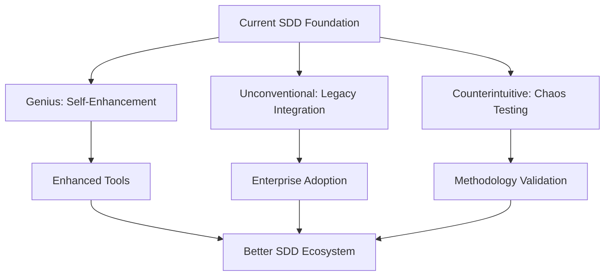

# 🎯 **SDD-COMPLIANT STRATEGIC APPROACHES**

*Three distinct paths forward, all following SDD methodology*  
*Strategic Analysis: June 11, 2025*

---

## 🧠 **APPROACH 1: GENIUS - "SDD Toolchain Dogfooding Factory"**

### **🎯 Core Insight**
Use our proven SDD toolchain to build **itself better** - create a recursive improvement cycle where each enhancement is built using SDD methodology on SDD tools.

### **🔗 Seam Analysis**
```typescript
// PRIMARY SEAM: SDD-on-SDD Enhancement Loop
interface SDDSelfEnhancementSeam {
  identifyGap(currentTools: SDDTool[], userFeedback: Feedback[]): Promise<ContractResult<ToolGap>>;
  generateEnhancement(gap: ToolGap): Promise<ContractResult<EnhancementPRD>>;
  buildWithSDD(prd: EnhancementPRD): Promise<ContractResult<NewTool>>;
  validateImprovement(newTool: NewTool, originalGap: ToolGap): Promise<ContractResult<ValidationResult>>;
}

// SECONDARY SEAMS:
// - Real Project Integration (users building real apps)
// - Feedback Collection (gathering enhancement requests)
// - Quality Assurance (ensuring each iteration improves)
// - Knowledge Distillation (documenting patterns learned)
```

### **🚀 Implementation Strategy**

**Phase 1: Choose the Highest-Impact Missing Tool** *(Week 1)*
- **Target**: Python Code Generator (most requested gap)
- **Method**: Use our SDD toolchain to analyze Python generation requirements
- **Process**: PRD → Seams → Contracts → Implementation using our own tools
- **Validation**: Build a real Python project using the generated code

**Phase 2: Create SDD Enhancement Methodology** *(Week 2-3)*
- **Document the recursive pattern**: How to use SDD to improve SDD
- **Create "SDD-on-SDD" guidelines**: Formal methodology for self-improvement
- **Build toolchain metrics**: Measure improvement effectiveness
- **Establish feedback loops**: Real user projects → Enhancement PRDs → New tools

**Phase 3: Scale the Pattern** *(Ongoing)*
- Each new tool built using SDD methodology
- Each enhancement validated through real-world projects
- Continuous improvement based on usage patterns
- Knowledge distillation into reusable patterns

### **💰 Why This Is Genius**
- **Leverage**: Uses our unique proven toolchain to build itself better
- **Validation**: Each enhancement is immediately validated through real use
- **Compound Growth**: Each improvement makes future improvements easier
- **Proof of Concept**: Demonstrates SDD effectiveness to potential adopters
- **Minimal Risk**: Building on proven foundation rather than starting fresh

---

## 🌀 **APPROACH 2: UNCONVENTIONAL - "Seam-First Enterprise Infiltration"**

### **🎯 Core Insight**
Instead of building more tools, **embed SDD seams into existing enterprise codebases** - start with seam identification only, then gradually introduce SDD tools as seams prove their value.

### **🔗 Seam Analysis**
```typescript
// PRIMARY SEAM: Legacy System Seam Discovery
interface LegacySeamDiscoverySeam {
  scanExistingCodebase(projectPath: string): Promise<ContractResult<ExistingSeam[]>>;
  identifyProblemSeams(seams: ExistingSeam[]): Promise<ContractResult<ProblematicSeam[]>>;
  suggestSeamImprovement(problemSeam: ProblematicSeam): Promise<ContractResult<SeamRecommendation>>;
  validateSeamBenefit(improvement: SeamImprovement): Promise<ContractResult<BenefitMeasurement>>;
}

// SECONDARY SEAMS:
// - Enterprise Integration (working within existing workflows)
// - Change Management (gradual adoption rather than revolution)
// - Value Demonstration (showing immediate benefits)
// - Tool Introduction (bringing SDD tools once seams are understood)
```

### **🚀 Implementation Strategy**

**Phase 1: Build "Seam Scanner" Tool** *(Week 1)*
- **Tool**: Analyze existing codebases and identify implicit seams
- **Output**: Visual map of how components currently communicate
- **Value**: Shows current integration pain points without requiring changes
- **Target**: Enterprise teams with existing large codebases

**Phase 2: Create "Seam Health Assessment"** *(Week 2)*
- **Analysis**: Rate current seam quality (coupling, clarity, error handling)
- **Recommendations**: Specific improvements for worst-performing seams
- **ROI Calculation**: Quantify potential benefits of seam improvements
- **Pilot Projects**: Identify best candidates for SDD adoption

**Phase 3: Gradual SDD Introduction** *(Week 3-4)*
- **Start**: Fix one problematic seam using SDD methodology
- **Measure**: Quantify improvement (bugs reduced, development speed, maintainability)
- **Expand**: Apply SDD to adjacent seams based on success
- **Educate**: Train team on SDD principles through proven wins

### **🌀 Why This Is Unconventional**
- **Backwards**: Start with existing code rather than greenfield
- **Stealth**: Introduce SDD concepts without calling them "SDD"
- **Gradual**: Evolutionary rather than revolutionary adoption
- **Proof-First**: Show value before asking for methodology change
- **Enterprise-Friendly**: Works within existing constraints and politics

---

## 🔄 **APPROACH 3: COUNTERINTUITIVE - "Build the Worst SDD Project Possible"**

### **🎯 Core Insight**
Deliberately build a **maximally complex, anti-pattern-heavy project** using SDD methodology to prove that SDD works even in the worst possible conditions. If SDD can succeed here, it can succeed anywhere.

### **🔗 Seam Analysis**
```typescript
// PRIMARY SEAM: Chaos Engineering for SDD
interface ChaosSDDSeam {
  designMaximalComplexity(requirements: Requirements): Promise<ContractResult<ChaosArchitecture>>;
  applySDDDiscipline(chaos: ChaosArchitecture): Promise<ContractResult<SeamDefinition[]>>;
  buildWithoutShortcuts(seams: SeamDefinition[]): Promise<ContractResult<ChaosProject>>;
  measureSDDEffectiveness(chaosProject: ChaosProject): Promise<ContractResult<EffectivenessMetrics>>;
}

// SECONDARY SEAMS:
// - Complexity Maximization (deliberate anti-patterns)
// - SDD Discipline Enforcement (strict methodology adherence)
// - Chaos Control (managing complexity through seams)
// - Learning Extraction (documenting what works under pressure)
```

### **🚀 Implementation Strategy**

**Phase 1: Design Maximum Complexity Project** *(Week 1)*
- **Requirements**: Multi-language, microservices, async messaging, complex state management
- **Anti-Patterns**: Include every common architecture mistake deliberately
- **Examples**: Circular dependencies, shared databases, mixed paradigms, inconsistent error handling
- **Seam Challenge**: Use SDD to manage this chaos through clear seam contracts

**The "Chaos E-Commerce Platform" Example:**
```
- Frontend: React + Vue + Angular (deliberate inconsistency)
- Backend: Node.js + Python + Java + Go services (language chaos)  
- Databases: SQL + NoSQL + Graph + Time-series (storage chaos)
- Communication: REST + GraphQL + gRPC + WebSockets + Message queues (protocol chaos)
- State: Shared mutable state across services (integration nightmare)
- Auth: Multiple auth systems that must interoperate (security chaos)
```

**Phase 2: Apply Pure SDD Discipline** *(Week 2-3)*
- **Seam Definition**: Define clear contracts for EVERY communication pathway
- **No Shortcuts**: Follow SDD methodology religiously despite complexity
- **Contract Enforcement**: Use ContractResult<T> pattern throughout
- **Blueprint Comments**: Document every integration point thoroughly
- **Validation**: Ensure 100% SDD compliance even in chaos

**Phase 3: Measure and Document** *(Week 4)*
- **Complexity Metrics**: Lines of code, integration points, failure modes
- **SDD Effectiveness**: How well seams contained the chaos
- **Failure Analysis**: Where SDD struggled and why
- **Success Patterns**: What SDD practices were most valuable under pressure
- **Learning Distillation**: Extract principles for high-complexity projects

### **🔄 Why This Is Counterintuitive**
- **Backwards Goal**: Deliberately create problems instead of solving them
- **Stress Test**: Proves SDD works under worst conditions
- **Anti-Marketing**: Shows ugly reality rather than perfect demos
- **Learning Accelerator**: Compresses years of painful lessons into weeks
- **Credibility Builder**: "If SDD works here, it works anywhere"
- **Pattern Discovery**: Finds SDD techniques that work under extreme pressure

---

## 🎯 **STRATEGIC SEAM COMPARISON**

### **🔗 Seam Interaction Analysis**


### **🎯 Recommended Approach Priority**

**Option 1: GENIUS** *(Highest ROI)*
- **Pros**: Builds on proven foundation, immediate value, compound growth
- **Cons**: May become inward-focused, needs real-world validation
- **Best For**: If you want to maximize toolchain quality quickly

**Option 2: UNCONVENTIONAL** *(Highest Adoption Potential)*  
- **Pros**: Enterprise-friendly, gradual adoption, immediate real-world testing
- **Cons**: Slower methodology validation, complex change management
- **Best For**: If you want widespread SDD adoption in existing organizations

**Option 3: COUNTERINTUITIVE** *(Highest Learning)*
- **Pros**: Rapid methodology validation, credibility building, pattern discovery
- **Cons**: High effort, no immediate business value, potential for failure
- **Best For**: If you want to prove SDD methodology robustness definitively

### **🚀 HYBRID RECOMMENDATION**

**Start with GENIUS approach** (Python generator using SDD-on-SDD) while **setting up UNCONVENTIONAL infiltration** (enterprise codebase scanning), and **plan COUNTERINTUITIVE validation** as a future credibility project.

**Seam Synergy**: Each approach strengthens the others through shared learnings and cross-validation.

---

*All three approaches are SDD-compliant and follow "Seams First, Implementation Second" methodology while serving different strategic objectives.*
